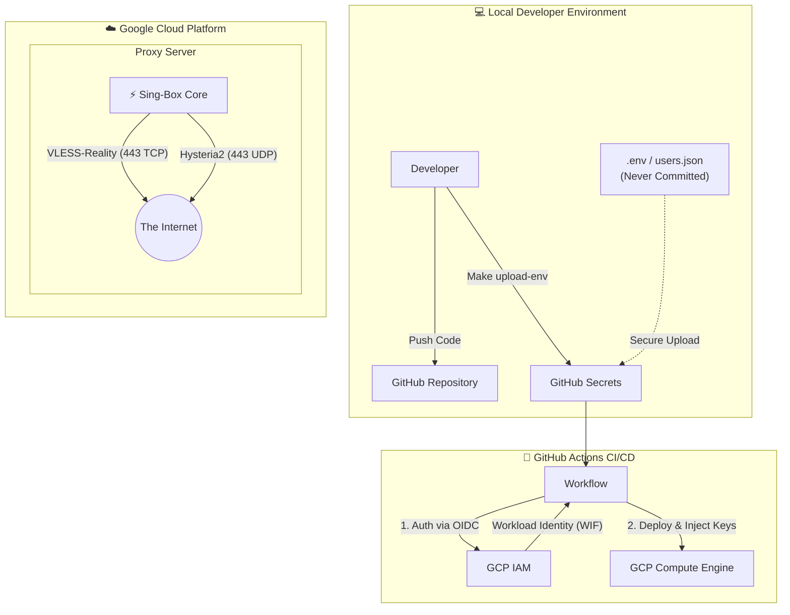

# Proxy Builder (Sing-box Native)

<div align="center">


**An enterprise-grade, automated GitOps deployment solution for high-performance proxy services.**

[Architecture](#-architecture) • [Features](#-features) • [Quick Start](#-quick-start) • [Cloud Infrastructure](#-cloud-and-security)

</div>

## 📖 Introduction

**Proxy Builder** is a **complete infrastructure-as-code solution**. It is designed to deploy a secure, resilient, and high-performance proxy server on Google Cloud Platform (GCP) using modern DevOps practices.

It leverages the powerful **Sing-box Core** running in native mode, with user configuration managed seamlessly via structured JSON secrets. The whole pipeline is orchestrated via **GitHub Actions** and secured by **Workload Identity Federation** (WIF).

## 🏗 Architecture

The system is designed for security and automation. We use a **Keyless** authentication approach for deployments.



### Key Concepts
- **Native Efficiency**: Pure `sing-box` runs without the overhead of panels or reverse proxies.
- **Keyless Deployment**: GitHub Actions authenticates with Google Cloud using OIDC. **No long-lived JSON service account keys are stored.**
- **GitOps User Mgmt**: Manage proxy users through a local `users.json` template injected securely as a GitHub Secret.

## ✨ Features

- **Protocol Support**: VLESS-TCP-Reality and Hysteria2 multiplexed beautifully on port 443.
- **Zero-Trust Security**: WIF authentication eliminates credential leaks.
- **One-Click Cloud Setup**: Scripts to automate VM creation, Firewall rules, and IAM binding.
- **Infrastructure as Code**: Everything is defined in scripts and `docker-compose.yml`.

## 🚀 Quick Start

### Prerequisites
- Google Cloud Platform (GCP) Project.
- A Domain Name (e.g., `example.com`).
- `gcloud` CLI installed and authenticated.
- `gh` (GitHub CLI) installed.

### 1. Cloud Infrastructure Setup
We provide automated scripts to set up the secure infrastructure on GCP.

```bash
# 1. Setup Workload Identity Federation (WIF)
# This binds your GitHub Repo to GCP without keys.
make setup-wif

# 2. Configure Firewall Rules
# Dynamically opens port 443 TCP/UDP based on config.
make setup-firewall
```

### 2. Configuration Strategy
We use secure `.env` files and `users.json` that are **never committed**.

**Base Environment:**
```bash
cp .env.production.example .env.production
nano .env.production
# Generate keys via: make reality-key
# Set REALITY_PRIVATE_KEY, REALITY_SHORT_ID, and REALITY_DEST
```

**User Management:**
```bash
cp users.example.json users.json
nano users.json
# Define proxy users, uuids, and passwords here.
```

### 3. Sync Configuration
Securely upload your local configuration to GitHub Secrets.

```bash
make upload-env
# Follow the prompts. It will compress users.json and upload it as USERS_JSON.
```

### 4. Deploy
Deployment is GitOps based.

- **Deploy to Production**:
  ```bash
  git push origin main
  ```
- **Deploy to Development**:
  ```bash
  git push origin dev
  ```

---

## ☁️ Cloud and Security

### Workload Identity Federation (WIF)
This project uses **WIF** to allow GitHub Actions to impersonate a Google Cloud Service Account.

**Why?**
- Eliminates the need to export and store dangerous Service Account Keys (`.json` files).
- GitHub issues a temporary OIDC token, which GCP validates.
- Access is strictly scoped to this specific GitHub repository.

**Setup Command:**
```bash
make setup-wif
```
*This interactive script will enable necessary APIs, create the Service Account, create the Identity Pool, and bind them to your repo.*

### Firewall Configuration
The proxy requires specific ports. We use `gcloud` to strictly allow only necessary traffic.

| Port | Protocol | Purpose |
|------|----------|---------|
| `443` | TCP/UDP | Reality (TCP) & Hysteria2 (UDP) Proxy Traffic |

**Setup Command:**
```bash
make setup-firewall
```
*This will dynamically read the `docker-compose.yml` and create the necessary VPC firewall rules in your GCP project (only 443).*

## 📄 License
MIT License.
