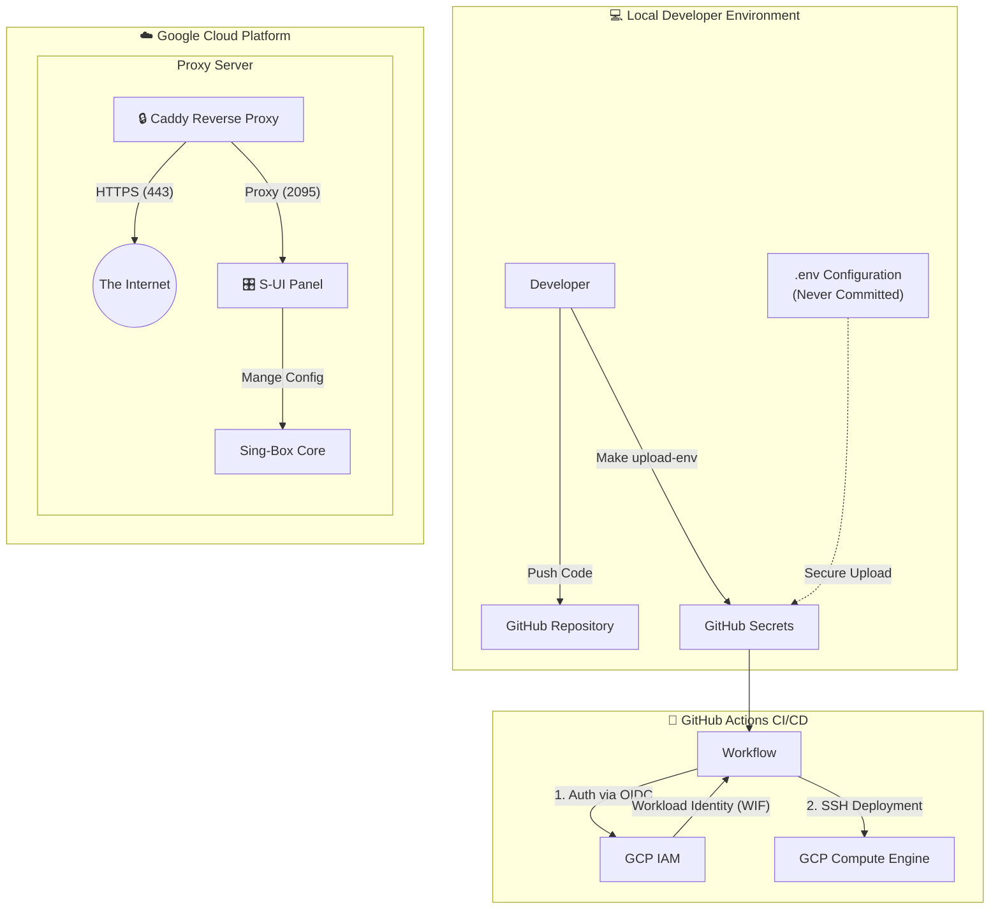

# Proxy Builder (S-UI)

<div align="center">


**An enterprise-grade, automated deployment solution for high-performance proxy services.**

[Architecture](#-architecture) • [Features](#-features) • [Quick Start](#-quick-start) • [Cloud Infrastructure](#-cloud-and-security)

</div>

## 📖 Introduction

**Proxy Builder** is not just a docker-compose file; it is a **complete infrastructure-as-code solution**. It is designed to deploy a secure, resilient, and high-performance proxy server on Google Cloud Platform (GCP) (or any Linux server) using modern DevOps practices.

It leverages **S-UI** for web-based management and **Caddy** for automatic HTTPS, all orchestrated via **GitHub Actions** and secured by **Workload Identity Federation** (WIF).

## 🏗 Architecture

The system is designed for security and automation. We use a **Keyless** authentication approach for deployments.



### Key Concepts
- **Automatic HTTPS**: Caddy automatically manages certificates for your panel (`panel.example.com`).
- **Keyless Deployment**: GitHub Actions authenticates with Google Cloud using OIDC. **No long-lived JSON service account keys are stored.**
- **Environment Isolation**: Separate configurations for `Production` (release) and `Development` (testing).

## ✨ Features

- **Web Management Panel**: Manage users and protocols via S-UI.
- **Protocol Support**: VLESS (Reality), Hysteria2, Trojan, Shadowsocks.
- **Zero-Trust Security**: WIF authentication eliminates credential leaks.
- **One-Click Cloud Setup**: Scripts to automate VM creation, Firewall rules, and IAM binding.
- **Infrastructure as Code**: Everything is defined in scripts and `docker-compose.yml`.

## 🚀 Quick Start

### Prerequisites
- Google Cloud Platform (GCP) Project.
- A Domain Name (e.g., `example.com`).
- `gcloud` CLI installed and authenticated.
- `gh` (GitHub CLI) installed.

### 1. Cloud Infrastructure Setup
We provide automated scripts to set up the secure infrastructure on GCP.

```bash
# 1. Setup Workload Identity Federation (WIF)
# This binds your GitHub Repo to GCP without keys.
make setup-wif

# 2. Configure Firewall Rules
# Opens ports 80, 443, 2095, 2096, etc.
make setup-firewall
```

### 2. Configuration Strategy
We use secure `.env` files that are **never committed**.

**Production Environment:**
```bash
cp .env.production.example .env.production
nano .env.production
# Set: PANEL_DOMAIN=panel.example.com
```

**Development Environment:**
```bash
cp .env.development.example .env.development
nano .env.development
# Set: PANEL_DOMAIN=dev.example.com
```

### 3. Sync Configuration
Securely upload your local configuration to GitHub Secrets.

```bash
make upload-env
# Follow the prompts to select the environment (e.g., Production)
```

### 4. Deploy
Deployment is GitOps based.

- **Deploy to Production**:
  ```bash
  git push origin main
  ```
- **Deploy to Development**:
  ```bash
  git push origin dev
  ```

---

## ☁️ Cloud and Security

### Workload Identity Federation (WIF)
This project uses **WIF** to allow GitHub Actions to impersonate a Google Cloud Service Account.

**Why?**
- Eliminates the need to export and store dangerous Service Account Keys (`.json` files).
- GitHub issues a temporary OIDC token, which GCP validates.
- Access is strictly scoped to this specific GitHub repository.

**Setup Command:**
```bash
make setup-wif
```
*This interactive script will enable necessary APIs, create the Service Account, create the Identity Pool, and bind them to your repo.*

### Firewall Configuration
The proxy requires specific ports. We use `gcloud` to strictly allow only necessary traffic.

| Port | Protocol | Purpose |
|------|----------|---------|
| `2095` | TCP | S-UI Web Panel (HTTPS) |
| `2096` | TCP | Subscription Links (HTTPS) |
| `80` | TCP | HTTP / ACME Challenges |
| `443` | TCP/UDP | HTTPS / Proxy Traffic |

**Setup Command:**
```bash
make setup-firewall
```
*This will create the necessary VPC firewall rules in your GCP project.*

## 🛠️ Local Development

You can run the full stack locally (on your Mac/Linux machine) to test configuration changes.

1. **Setup Env**:
   ```bash
   cp .env.development.example .env
   # Set PANEL_DOMAIN=localhost
   ```
2. **Start Services**:
   ```bash
   make dev
   ```
3. **Access**:
   Open `https://localhost:2095` (Accept self-signed cert).

## 📄 License
MIT License.
